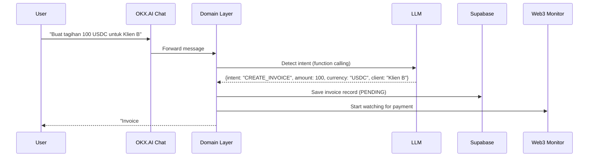

# 🤖 MASTER PROMPT — SoloFi CFO (Autonomous Web3 Finance Agent)
## OKX.AI Genesis Hackathon | Deadline: 17 Juli 2026

---

> **Cara pakai prompt ini:**
> Paste seluruh isi prompt ini ke AI coding agent kamu (Claude Code, Cursor, Codex, dll)
> di root folder proyek yang sudah kamu buat. Jalankan satu kali di awal sebelum coding.
> Untuk Graphify: jalankan `/graphify .` setiap kali struktur proyek berubah signifikan.

---

## 🎯 CONTEXT & MISSION

Kamu adalah **Lead Architect + Tech Writer** untuk proyek hackathon bernama **SoloFi CFO** yang akan dikompetisikan di **OKX.AI Genesis Hackathon**. Deadline pengumpulan adalah **17 Juli 2026** — waktu sangat terbatas.

Tugasmu adalah:
1. Membuat seluruh dokumentasi proyek (README, PRD, System Design, dll)
2. Membangun struktur kode yang bersih dan siap untuk vibe coding
3. Mengintegrasikan Graphify agar kamu (sebagai agent) bisa menavigasi codebase dengan efisien

Kerjakan semua ini **secara sistematis, satu per satu**, dan konfirmasi setiap selesai sebelum lanjut ke langkah berikutnya.

---

## 📌 PRODUCT BRIEF

### Nama Produk
**SoloFi CFO** — Autonomous Web3 Finance Agent

### Elevator Pitch
Agen AI di platform OKX.AI yang bertindak sebagai **Chief Financial Officer otomatis** untuk Web3 freelancer, remote worker, dan solopreneur yang dibayar menggunakan kripto.

### Masalah yang Diselesaikan
- Pendapatan kripto tersebar di banyak wallet, susah dilacak
- Tidak ada pemisahan antara keuangan personal dan operasional
- Alokasi dana manual (dana darurat, investasi, dll) tiap ada pembayaran masuk itu melelahkan
- Tidak ada laporan cashflow yang mudah dibaca untuk pengguna non-teknis

### Solusi
Hubungkan wallet (jaringan **X Layer** dari OKX), atur aturan alokasi lewat **chat natural language**, dan biarkan agen mengerjakan sisanya secara otomatis on-chain.

---

## 🏗️ FITUR MVP (3 PILAR UTAMA)

### Pilar 1: Smart Invoicing & Auto-Tracking
- User request invoice via chat: `"Buat tagihan 100 USDC untuk Klien B"`
- Agent men-generate instruksi pembayaran
- Agent mendeteksi pembayaran masuk secara on-chain di X Layer
- Transaksi otomatis dikategorikan sebagai pendapatan di database

### Pilar 2: Autonomous Budgeting — "Pockets System"
- User set aturan via chat: `"Setiap ada dana masuk, bagi: 50% Operasional, 30% Pribadi, 20% Dana Darurat"`
- Begitu Pilar 1 mendeteksi pembayaran masuk, agent otomatis mengeksekusi transfer token ke wallet address masing-masing "kantong"
- Semua transaksi splitting terekam di log

### Pilar 3: AI Financial Advisor Chat
- User tanya kondisi keuangan via natural language: `"Berapa sisa di kantong operasional?"` atau `"Ringkasan cashflow minggu ini"`
- Agent membaca data on-chain + database dan menjawab dalam bahasa natural

---

## 🏛️ ARSITEKTUR SISTEM

```
┌─────────────────────────────────────────────────────────┐
│              PRESENTATION LAYER                         │
│         OKX.AI Chat Interface (built-in)                │
└────────────────────┬────────────────────────────────────┘
                     │
┌────────────────────▼────────────────────────────────────┐
│                DOMAIN LAYER                             │
│  Node.js Backend + LLM Function Calling                 │
│  - Intent detection (invoice / set rule / query)        │
│  - Business logic orchestration                         │
│  - Response formatting                                  │
└──────────┬──────────────────────────┬───────────────────┘
           │                          │
┌──────────▼──────────┐  ┌───────────▼───────────────────┐
│    DATA LAYER        │  │    INFRASTRUCTURE LAYER        │
│    Supabase          │  │    Web3 (Viem / Ethers.js)     │
│  - Invoice metadata  │  │  - X Layer on-chain monitoring │
│  - Pocket wallets    │  │  - Token transfer execution    │
│  - Transaction logs  │  │  - Balance queries             │
└─────────────────────┘  └───────────────────────────────┘
```

**Tech Stack (Flexible — sesuaikan dengan hasil diskusi tim):**
- **Runtime:** Node.js
- **Framework:** Express / Fastify / Hono (TBD)
- **LLM:** OpenAI Function Calling API atau OKX.AI built-in model (TBD)
- **Database:** Supabase (PostgreSQL)
- **Web3:** Viem atau Ethers.js (TBD)
- **Blockchain:** X Layer (OKX's EVM-compatible L2)
- **Platform:** OKX.AI Agent Platform

> ⚠️ PENTING: Tech stack ditandai TBD akan diputuskan oleh tim. Kamu boleh membuat placeholder dan TODO comment di tempat-tempat ini. Jangan hardcode library spesifik untuk hal yang belum diputuskan.

---

## 📋 TUGAS YANG HARUS DIKERJAKAN

Kerjakan **dalam urutan ini**. Selesaikan satu sebelum lanjut ke berikutnya.

---

### TAHAP 0: Setup Graphify (KERJAKAN PERTAMA)

Sebelum apapun, install dan setup Graphify agar kamu bisa menavigasi codebase ini dengan efisien:

```bash
# Install Graphify
uv tool install graphifyy

# Register skill ke coding assistant kamu
graphify install

# Setelah struktur folder dibuat (di Tahap 1), jalankan:
/graphify .
```

Setelah struktur proyek selesai dibuat (Tahap 1), jalankan `/graphify .` dan commit hasilnya ke git. Ini akan membuat `graphify-out/` berisi:
- `graph.html` — visualisasi interaktif seluruh codebase
- `GRAPH_REPORT.md` — ringkasan arsitektur
- `graph.json` — queryable knowledge graph

**Manfaat Graphify untuk proyek ini:**
- Query codebase tanpa perlu grep: `/graphify query "bagaimana alur invoice detection?"`
- Trace hubungan antar modul: `/graphify path "InvoiceService" "Web3Monitor"`
- Review arsitektur sebelum menambah fitur baru

---

### TAHAP 1: Buat Struktur Folder Proyek

Buat struktur folder berikut. Sesuaikan jika tech stack berubah:

```
solofi-cfo/
├── README.md                      ← akan diisi di Tahap 2
├── PRD.md                         ← akan diisi di Tahap 3
├── ARCHITECTURE.md                ← akan diisi di Tahap 4
├── CONTRIBUTING.md                ← panduan kontribusi tim
├── .env.example                   ← template environment variables
├── .gitignore
├── package.json
│
├── src/
│   ├── index.js                   ← entry point
│   │
│   ├── domain/                    ← business logic
│   │   ├── invoice/
│   │   │   ├── InvoiceService.js
│   │   │   ├── InvoiceRepository.js
│   │   │   └── invoice.types.js
│   │   ├── pocket/
│   │   │   ├── PocketService.js
│   │   │   ├── PocketRepository.js
│   │   │   └── pocket.types.js
│   │   └── advisor/
│   │       └── AdvisorService.js
│   │
│   ├── infrastructure/            ← Web3 & external services
│   │   ├── web3/
│   │   │   ├── XLayerMonitor.js   ← on-chain monitoring
│   │   │   ├── TokenTransfer.js   ← execute transfers
│   │   │   └── web3.config.js
│   │   └── database/
│   │       ├── supabase.client.js
│   │       └── migrations/
│   │           └── 001_initial_schema.sql
│   │
│   ├── agent/                     ← LLM orchestration
│   │   ├── intentRouter.js        ← detect user intent
│   │   ├── functions/             ← function definitions untuk LLM
│   │   │   ├── createInvoice.fn.js
│   │   │   ├── setPocketRule.fn.js
│   │   │   └── queryBalance.fn.js
│   │   └── prompts/
│   │       └── systemPrompt.js
│   │
│   └── api/                       ← HTTP routes (jika diperlukan)
│       └── webhook.js             ← terima event dari OKX.AI
│
├── tests/
│   ├── unit/
│   └── integration/
│
└── docs/
    ├── diagrams/                  ← simpan file diagram di sini
    └── api-spec.md
```

Setelah selesai:
1. Inisialisasi `package.json` dengan `npm init -y`
2. Buat `.gitignore` yang tepat (node_modules, .env, graphify-out/cache/)
3. Buat `.env.example` dengan semua variabel yang dibutuhkan
4. Jalankan `git init && git add . && git commit -m "feat: initial project structure"`
5. Jalankan `/graphify .` — commit hasilnya

---

### TAHAP 2: Buat README.md

Buat `README.md` yang **lengkap, profesional, dan siap untuk hackathon judges**. Harus mencakup:

```markdown
# SoloFi CFO 🤖💰
> Autonomous Web3 Finance Agent for Freelancers & Solopreneurs

## 🎯 Problem Statement
[Jelaskan masalah nyata yang dialami Web3 freelancer]

## 💡 Solution
[Jelaskan solusi SoloFi CFO secara singkat dan jelas]

## ✨ Features (MVP)
[3 pilar fitur dengan penjelasan user-facing]

## 🏗️ Architecture
[Diagram arsitektur (gunakan Mermaid atau ASCII)]

## 🚀 Quick Start
[Langkah setup dari clone sampai running]

## 🔧 Tech Stack
[Tabel tech stack yang digunakan]

## 📡 API Reference
[Endpoint atau function calling schema]

## 🌐 X Layer Integration
[Jelaskan bagaimana integrasi dengan X Layer bekerja]

## 🤝 Team
[Placeholder untuk nama tim]

## 📄 License
MIT
```

Pastikan README:
- Menggunakan badge (build status, license, dll)
- Menyertakan diagram arsitektur dengan Mermaid
- Punya section "Demo" dengan contoh chat interaction
- Ditulis dalam **Bahasa Inggris** (untuk hackathon judges)

---

### TAHAP 3: Buat PRD.md (Product Requirements Document)

Buat `PRD.md` yang detail. Struktur:

```markdown
# Product Requirements Document — SoloFi CFO
Version: 1.0 | Status: Draft | Date: [tanggal]

## 1. Executive Summary
## 2. Problem Statement & Market Opportunity
## 3. Goals & Non-Goals
   - Goals (apa yang AKAN dibangun)
   - Non-Goals (apa yang TIDAK akan dibangun di MVP ini)
## 4. User Personas
   - Persona 1: Web3 Freelancer Developer
   - Persona 2: Remote Worker dibayar USDC
   - Persona 3: Crypto Solopreneur
## 5. User Stories
   - Format: "Sebagai [persona], saya ingin [aksi] agar [manfaat]"
   - Minimal 10 user stories, diberi priority (P0/P1/P2)
## 6. Functional Requirements
   - Pilar 1: Smart Invoicing
   - Pilar 2: Pocket Budgeting
   - Pilar 3: AI Advisor Chat
## 7. Non-Functional Requirements
   - Performance (latency target untuk on-chain detection)
   - Security (private key management)
   - Reliability (uptime target)
## 8. Technical Constraints
   - Hackathon deadline: 17 Juli 2026
   - Harus terintegrasi dengan OKX.AI platform
   - Harus berjalan di X Layer
## 9. Success Metrics
   - Metrics yang akan diukur di demo
## 10. Out of Scope (Future Features)
   - Multi-chain support
   - Tax reporting
   - Fiat on/off ramp
```

---

### TAHAP 4: Buat ARCHITECTURE.md

Buat `ARCHITECTURE.md` yang menjelaskan:

```markdown
# SoloFi CFO — System Architecture

## Overview
## Component Diagram (Mermaid)
## Data Flow Diagrams
   - Invoice Creation Flow
   - Payment Detection Flow
   - Pocket Auto-Split Flow
   - AI Query Flow
## Database Schema
   - Tabel: invoices
   - Tabel: pockets
   - Tabel: transaction_logs
   - Tabel: users
## API Contracts
   - LLM Function Definitions
   - Internal service interfaces
## Security Considerations
   - Private key storage strategy
   - Supabase RLS policies
## Deployment Architecture
```

Sertakan diagram sequence dengan Mermaid untuk setiap flow utama. Contoh:



---

### TAHAP 5: Buat Database Schema

Buat file `src/infrastructure/database/migrations/001_initial_schema.sql`:

Schema harus mencakup tabel:
- `users` (id, wallet_address, created_at)
- `invoices` (id, user_id, client_name, amount, currency, status [PENDING/PAID/CANCELLED], payment_tx_hash, created_at, paid_at)
- `pockets` (id, user_id, name, wallet_address, percentage, created_at)
- `pocket_rules` (id, user_id, is_active, created_at, updated_at)
- `transaction_logs` (id, user_id, invoice_id, tx_hash, from_address, to_address, amount, currency, action [RECEIVE/SPLIT], created_at)

Gunakan best practices Supabase:
- Aktifkan Row Level Security (RLS) pada setiap tabel
- Buat policy yang sesuai
- Gunakan UUID untuk primary keys
- Tambahkan index yang diperlukan

---

### TAHAP 6: Buat Scaffold Kode Utama

Buat skeleton kode (dengan TODO comment yang jelas) untuk:

**6a. `src/agent/intentRouter.js`**
Fungsi utama yang menerima pesan user, memanggil LLM dengan function definitions, dan me-route ke service yang tepat.

```javascript
// Contoh struktur yang diharapkan:
async function routeIntent(userMessage, userId) {
  // 1. Call LLM with function definitions
  // 2. Parse function call response
  // 3. Route to appropriate service:
  //    - CREATE_INVOICE → InvoiceService.create()
  //    - SET_POCKET_RULE → PocketService.setRule()
  //    - QUERY_BALANCE → AdvisorService.queryBalance()
  //    - QUERY_CASHFLOW → AdvisorService.queryCashflow()
  // 4. Return formatted response
}
```

**6b. `src/agent/functions/` — LLM Function Definitions**
Buat JSON schema untuk setiap function yang bisa dipanggil LLM:
- `createInvoice` — params: client_name, amount, currency
- `setPocketRule` — params: rules (array of {name, wallet_address, percentage})
- `queryBalance` — params: pocket_name (optional)
- `queryCashflow` — params: period (week/month)

**6c. `src/infrastructure/web3/XLayerMonitor.js`**
Class untuk memonitor X Layer (placeholder dengan TODO):

```javascript
class XLayerMonitor {
  // TODO: Initialize viem/ethers client untuk X Layer
  // TODO: watchForPayment(walletAddress, expectedAmount, onDetected)
  // TODO: getBalance(walletAddress, tokenAddress)
}
```

**6d. `src/infrastructure/web3/TokenTransfer.js`**
Class untuk mengeksekusi transfer (placeholder dengan TODO):

```javascript
class TokenTransfer {
  // TODO: splitPayment(amount, pocketRules) — eksekusi multi-transfer sesuai aturan kantong
  // TODO: transferToken(from, to, amount, tokenAddress)
}
```

**6e. `src/domain/invoice/InvoiceService.js`**
Business logic untuk invoice:

```javascript
class InvoiceService {
  // createInvoice(userId, clientName, amount, currency)
  // markAsPaid(invoiceId, txHash)
  // getInvoicesByUser(userId)
  // getPendingInvoices(userId)
}
```

**6f. `src/domain/pocket/PocketService.js`**
Business logic untuk pocket management:

```javascript
class PocketService {
  // setPocketRules(userId, rules)
  // getPocketRules(userId)
  // executeSplit(userId, receivedAmount, currency) — dipanggil saat invoice PAID
}
```

**6g. `src/agent/prompts/systemPrompt.js`**
Export system prompt untuk LLM:

```javascript
const SYSTEM_PROMPT = `
Kamu adalah SoloFi CFO, asisten keuangan otomatis untuk Web3 freelancer.
Kamu membantu pengguna dalam:
1. Membuat dan melacak invoice pembayaran kripto
2. Mengatur alokasi otomatis dana masuk ke "kantong" yang berbeda
3. Memantau kondisi keuangan dan memberikan ringkasan cashflow

Selalu jawab dalam bahasa yang sama dengan pertanyaan user (Indonesia atau Inggris).
Untuk angka kripto, tampilkan dengan presisi yang wajar (max 6 desimal).
Jika user bertanya tentang sesuatu di luar lingkup keuangan kripto, arahkan mereka kembali ke topik yang relevan.
`;
```

---

### TAHAP 7: Setup Graphify Secara Penuh

Setelah semua kode scaffold dibuat, jalankan Graphify untuk membuat knowledge graph:

```bash
# Build knowledge graph untuk seluruh proyek
/graphify .

# Commit hasilnya
git add graphify-out/
git commit -m "chore: add graphify knowledge graph"
```

Kemudian setup agar Graphify selalu digunakan:
```bash
graphify claude install    # jika pakai Claude Code
# atau
graphify cursor install   # jika pakai Cursor
```

Dari titik ini, sebelum menambah fitur baru, selalu query dulu:
```bash
/graphify query "bagaimana alur dari invoice creation sampai pocket split?"
/graphify path "InvoiceService" "PocketService"
/graphify explain "XLayerMonitor"
```

---

### TAHAP 8: Buat File Konfigurasi & DevOps

**8a. `.env.example`**
```env
# OKX.AI
OKX_AI_API_KEY=your_okx_ai_api_key_here
OKX_AI_AGENT_ID=your_agent_id_here

# LLM (pilih salah satu)
OPENAI_API_KEY=your_openai_key_here
# atau gunakan OKX.AI built-in model

# Database
SUPABASE_URL=https://your-project.supabase.co
SUPABASE_ANON_KEY=your_anon_key_here
SUPABASE_SERVICE_ROLE_KEY=your_service_role_key_here

# Web3 — X Layer
X_LAYER_RPC_URL=https://rpc.xlayer.tech
X_LAYER_CHAIN_ID=196
AGENT_WALLET_PRIVATE_KEY=your_agent_wallet_private_key_here

# Token Addresses (X Layer)
USDC_ADDRESS=0x...
USDT_ADDRESS=0x...

# App
PORT=3000
NODE_ENV=development
```

**8b. `CONTRIBUTING.md`**
Buat panduan kontribusi singkat untuk tim:
- Cara setup local environment
- Git workflow (branch naming, commit message format)
- Code style guide
- Cara menjalankan tests

---

### TAHAP 9: Buat Demo Script

Buat file `docs/DEMO_SCRIPT.md` yang berisi skenario demo untuk hackathon judges:

```markdown
# SoloFi CFO — Demo Script

## Setup (sebelum demo)
[Langkah persiapan]

## Skenario Demo (5 menit)

### Skenario 1: Membuat Invoice (1 menit)
User: "Buat tagihan 100 USDC untuk Klien Alpha"
Expected: [tunjukkan response agent + tampilkan di database]

### Skenario 2: Setup Pocket Rules (1 menit)
User: "Set aturan: 50% kantong operasional ke 0x..., 30% pribadi ke 0x..., 20% dana darurat ke 0x..."
Expected: [tunjukkan rules tersimpan]

### Skenario 3: Simulasi Pembayaran (2 menit)
[Langkah-langkah untuk trigger payment detection di testnet]
Expected: [auto-split terjadi, semua kantong terisi]

### Skenario 4: Query Keuangan (1 menit)
User: "Berikan ringkasan cashflow minggu ini"
Expected: [ringkasan natural language dari data on-chain]

## Talking Points untuk Judges
- Fully autonomous: tidak perlu intervensi manual
- On-chain: semua transaksi terverifikasi di X Layer
- Natural language: tidak perlu UI rumit, cukup chat
```

---

## ✅ CHECKLIST SEBELUM SUBMIT

Setelah semua tahap selesai, verifikasi:

- [ ] `README.md` sudah ada, informatif, dan ada demo GIF/screenshot
- [ ] `PRD.md` sudah ada dengan user stories yang jelas
- [ ] `ARCHITECTURE.md` sudah ada dengan diagram Mermaid
- [ ] Database schema sudah dibuat
- [ ] Semua skeleton kode sudah ada dengan TODO yang jelas
- [ ] Graphify sudah dijalankan dan `graphify-out/` sudah di-commit
- [ ] `.env.example` sudah ada (tanpa secret apapun)
- [ ] Demo bisa dijalankan end-to-end (minimal dengan mock data)
- [ ] Kode sudah di-push ke GitHub dengan repo yang bersih

---

## 🚨 ATURAN PENTING UNTUK AGENT

1. **Jangan skip tahap** — kerjakan secara berurutan
2. **Konfirmasi setiap selesai satu tahap** sebelum lanjut
3. **Gunakan TODO comment** untuk bagian yang bergantung pada keputusan tim (tech stack TBD)
4. **Jangan hardcode secrets** — selalu gunakan environment variables
5. **Prioritaskan MVP** — jangan build feature yang tidak ada di 3 pilar utama
6. **Jalankan Graphify ulang** setiap ada perubahan struktur folder atau file baru yang signifikan
7. **Gunakan Bahasa Inggris** untuk semua dokumentasi yang akan dilihat judges
8. **Gunakan Bahasa Indonesia** untuk komentar internal dan TODO jika membantu tim
9. **Deadline ketat** — jika ada pilihan antara sempurna vs selesai, pilih selesai dan beri TODO

---

## 📞 REFERENSI

- OKX.AI Platform: https://www.okx.com/web3/build/docs/devportal/introduction-to-okx-os
- X Layer Documentation: https://www.okx.com/xlayer/docs
- Graphify: https://github.com/Graphify-Labs/graphify
- Supabase Docs: https://supabase.com/docs
- Viem Docs: https://viem.sh
- Ethers.js Docs: https://docs.ethers.org

---

*Prompt ini dibuat untuk OKX.AI Genesis Hackathon. Tech stack yang ditandai TBD akan diputuskan oleh tim sebelum coding dimulai.*
