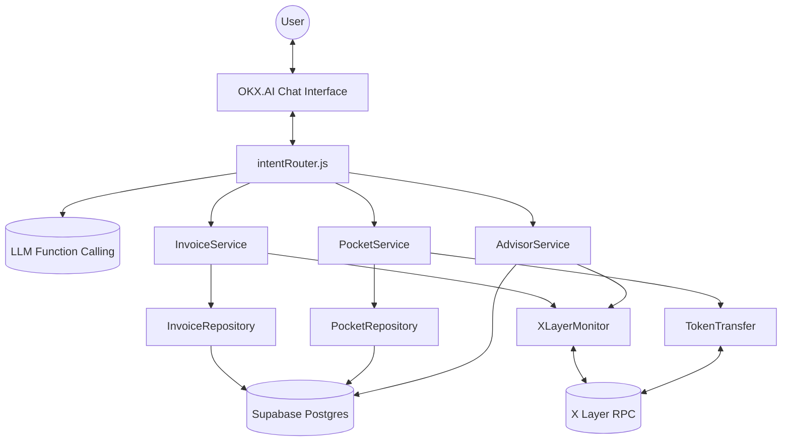
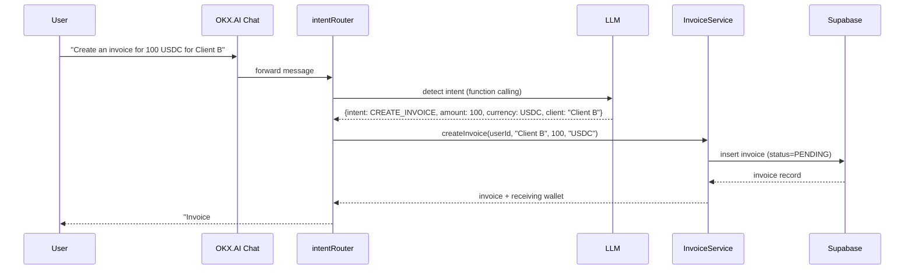
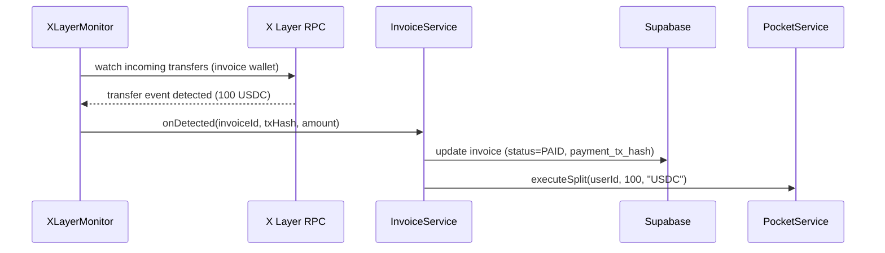
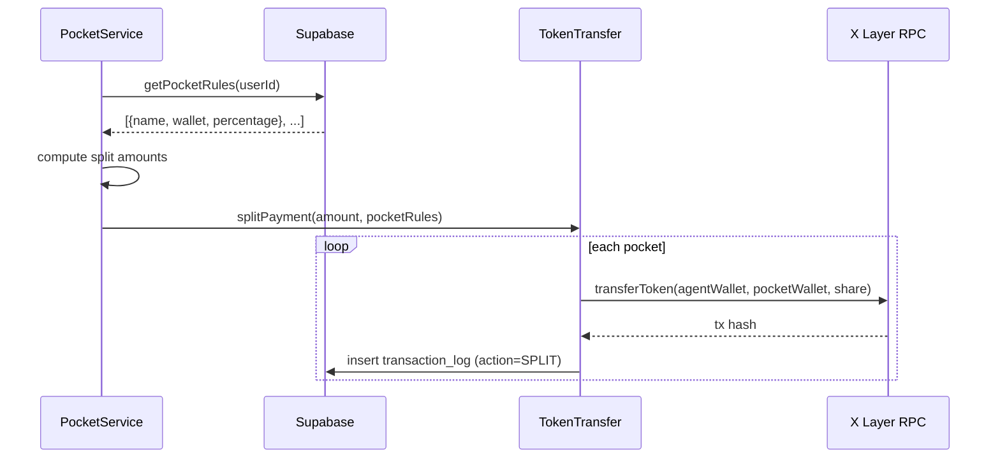
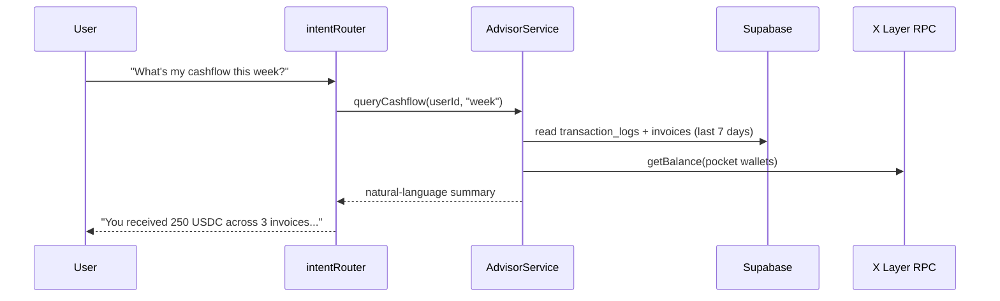

# SoloFi CFO — System Architecture

## Overview

SoloFi CFO is a Node.js backend agent that sits behind the OKX.AI chat interface. It uses LLM function calling to translate natural language into structured intents, routed to domain services (`InvoiceService`, `PocketService`, `AdvisorService`). Domain services orchestrate two backing systems: Supabase (Postgres) for persistent state, and X Layer (via an EVM client — Viem/Ethers, TBD) for on-chain monitoring and token transfers.

## Component Diagram

## Data Flow Diagrams

### Invoice Creation Flow

### Payment Detection Flow

### Pocket Auto-Split Flow

### AI Query Flow

## Database Schema

See [`src/infrastructure/database/migrations/001_initial_schema.sql`](./src/infrastructure/database/migrations/001_initial_schema.sql) for the executable definition.

- **`users`** — `id, wallet_address, created_at`
- **`invoices`** — `id, user_id, client_name, amount, currency, status [PENDING/PAID/CANCELLED], payment_tx_hash, created_at, paid_at`
- **`pockets`** — `id, user_id, name, wallet_address, percentage, created_at`
- **`pocket_rules`** — `id, user_id, is_active, created_at, updated_at`
- **`transaction_logs`** — `id, user_id, invoice_id, tx_hash, from_address, to_address, amount, currency, action [RECEIVE/SPLIT], created_at`

## API Contracts

### LLM Function Definitions

Defined in `src/agent/functions/`:

| Function | Params | Returns |
|---|---|---|
| `createInvoice` | `client_name: string, amount: number, currency: string` | invoice id + receiving wallet |
| `setPocketRule` | `rules: {name, wallet_address, percentage}[]` | confirmation of saved rules |
| `queryBalance` | `pocket_name?: string` | balance(s) |
| `queryCashflow` | `period: "week"\|"month"` | natural-language summary |

### Internal Service Interfaces

- `InvoiceService.createInvoice(userId, clientName, amount, currency)`
- `InvoiceService.markAsPaid(invoiceId, txHash)`
- `InvoiceService.getInvoicesByUser(userId)`
- `InvoiceService.getPendingInvoices(userId)`
- `PocketService.setPocketRules(userId, rules)`
- `PocketService.getPocketRules(userId)`
- `PocketService.executeSplit(userId, receivedAmount, currency)`
- `XLayerMonitor.watchForPayment(walletAddress, expectedAmount, onDetected)`
- `XLayerMonitor.getBalance(walletAddress, tokenAddress)`
- `TokenTransfer.splitPayment(amount, pocketRules)`
- `TokenTransfer.transferToken(from, to, amount, tokenAddress)`

## Security Considerations

- **Private key storage:** the agent wallet's private key is read only from `AGENT_WALLET_PRIVATE_KEY` env var / secrets manager — never committed, never logged, never returned in any API response.
- **Supabase RLS:** every table has Row Level Security enabled; policies restrict all reads/writes to rows matching the authenticated `user_id` (service-role key used only server-side for the agent's own writes).
- **Input validation:** all LLM function-call arguments are validated (type, range, percentage sums to 100) before touching the database or chain.

## Deployment Architecture

- Node.js backend deployed as the OKX.AI agent's backend service (hosting target TBD — likely containerized).
- Supabase project (managed Postgres) as the single source of persistent state.
- X Layer RPC endpoint (public or dedicated node) for on-chain reads/writes.
- Environment-specific config via `.env` (see `.env.example`), never checked into git.
