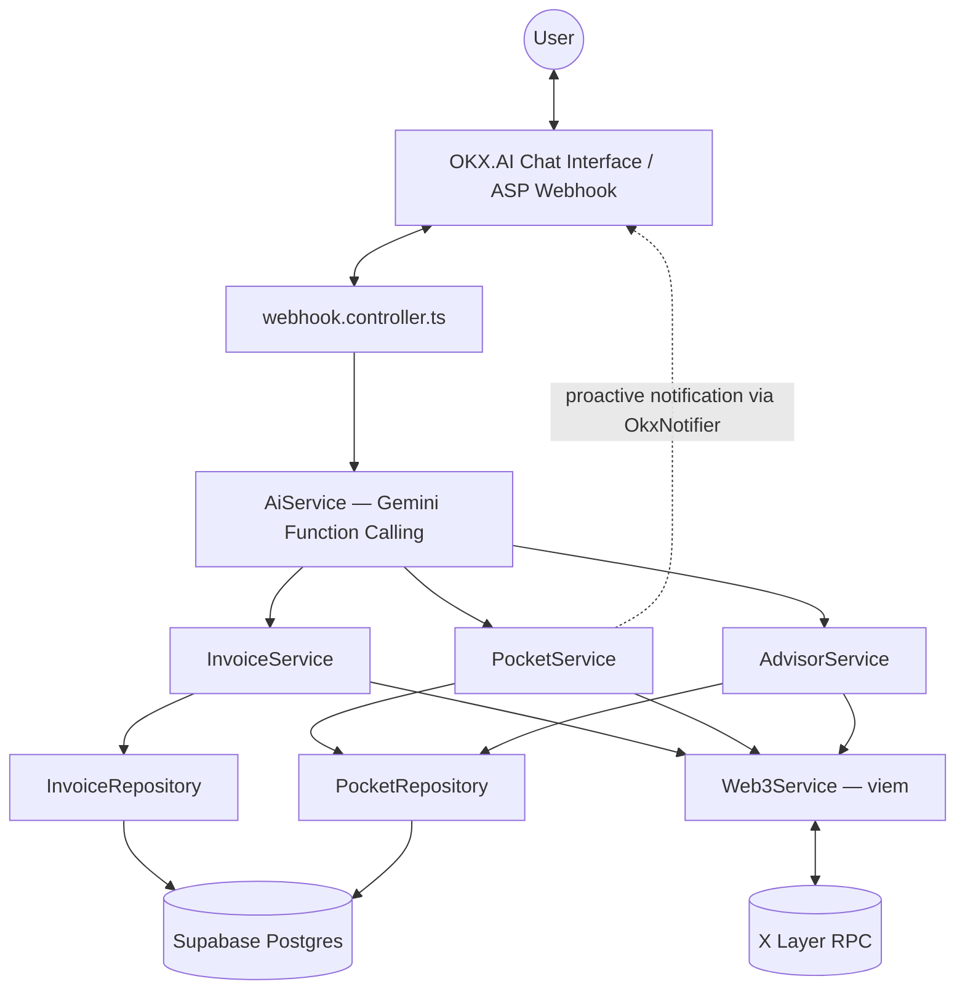
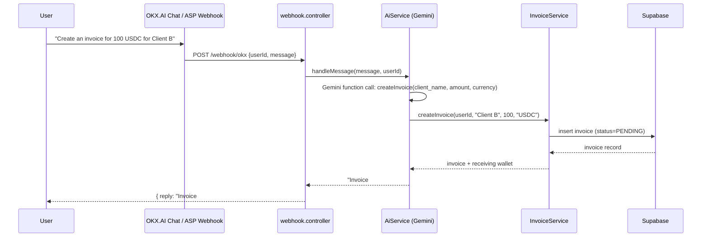
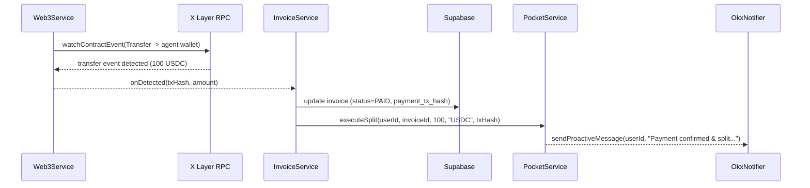
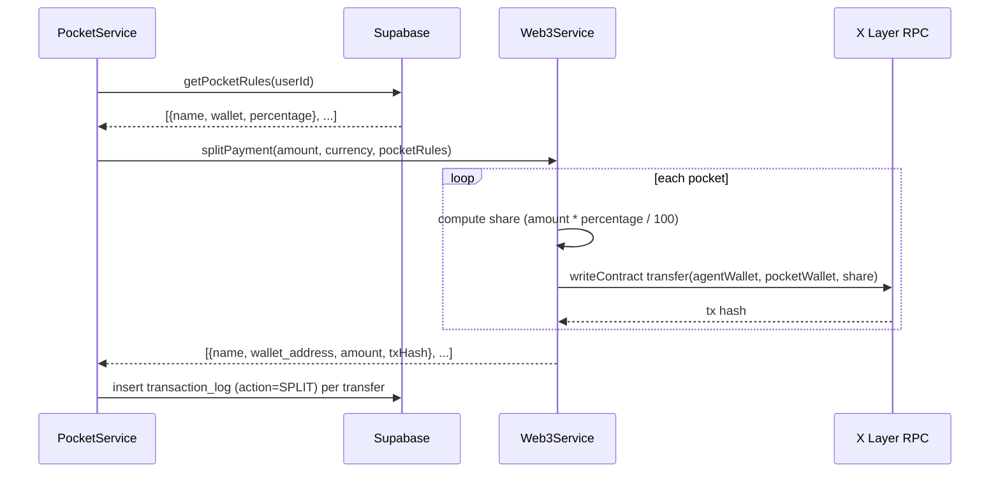
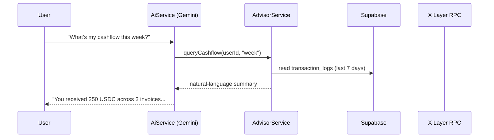

# SoloFi CFO — System Architecture

## Overview

SoloFi CFO is a Node.js/TypeScript backend agent with no frontend — it sits entirely behind the OKX.AI Agent Service Provider (ASP) webhook interface. It uses the Google Gemini API (Tool Use / Function Calling) to translate natural language into structured intents, routed to domain services (`InvoiceService`, `PocketService`, `AdvisorService`). Domain services orchestrate two backing systems: Supabase (Postgres) for persistent state, and X Layer (via `viem`) for on-chain monitoring and token transfers.

## Component Diagram

## Data Flow Diagrams

### Invoice Creation Flow

### Payment Detection Flow

### Pocket Auto-Split Flow

### AI Query Flow

## Database Schema

See [`src/database/migrations/001_initial_schema.sql`](./src/database/migrations/001_initial_schema.sql) for the executable definition.

- **`users`** — `id, wallet_address, created_at`
- **`invoices`** — `id, user_id, client_name, amount, currency, status [PENDING/PAID/CANCELLED], payment_tx_hash, created_at, paid_at`
- **`pockets`** — `id, user_id, name, wallet_address, percentage, created_at`
- **`pocket_rules`** — `id, user_id, is_active, created_at, updated_at`
- **`transaction_logs`** — `id, user_id, invoice_id, tx_hash, from_address, to_address, amount, currency, action [RECEIVE/SPLIT], created_at`

## API Contracts

### LLM Function Definitions

Defined in [`src/agent/functions/index.ts`](./src/agent/functions/index.ts) (Gemini `FunctionDeclaration` format), dispatched in [`src/services/AiService.ts`](./src/services/AiService.ts):

| Function | Params | Returns |
|---|---|---|
| `createInvoice` | `client_name: string, amount: number, currency: string` | invoice id + receiving wallet |
| `setPocketRule` | `rules: {name, wallet_address, percentage}[]` | confirmation of saved rules |
| `queryBalance` | `pocket_name?: string` | balance(s) |
| `queryCashflow` | `period: "week"\|"month"` | natural-language summary |

### Internal Service Interfaces

- [`InvoiceService`](./src/services/InvoiceService.ts) — `createInvoice(userId, clientName, amount, currency)`, `markAsPaid(invoiceId, txHash)`, `getInvoicesByUser(userId)`, `getPendingInvoices(userId)`
- [`PocketService`](./src/services/PocketService.ts) — `setPocketRules(userId, rules)`, `getPocketRules(userId)`, `executeSplit(userId, invoiceId, receivedAmount, currency, paymentTxHash)`
- [`AdvisorService`](./src/services/AdvisorService.ts) — `queryBalance(userId, pocketName?)`, `queryCashflow(userId, period)`
- [`Web3Service`](./src/services/Web3Service.ts) — `getAgentAddress()`, `getBalance(walletAddress, currency)`, `watchForPayment(walletAddress, expectedAmount, currency, onDetected)`, `transferToken(to, amount, currency)`, `splitPayment(amount, currency, pocketRules)`

## Security Considerations

- **Private key storage:** the agent wallet's private key is read only from `AGENT_WALLET_PRIVATE_KEY` env var / secrets manager — never committed, never logged, never returned in any API response.
- **Supabase RLS:** every table has Row Level Security enabled; policies restrict all reads/writes to rows matching the authenticated `user_id` (service-role key used only server-side for the agent's own writes).
- **Input validation:** all LLM function-call arguments are validated (type, range, percentage sums to 100) before touching the database or chain.

## Deployment Architecture

- Node.js backend deployed as the OKX.AI agent's backend service (hosting target TBD — likely containerized).
- Supabase project (managed Postgres) as the single source of persistent state.
- X Layer RPC endpoint (public or dedicated node) for on-chain reads/writes.
- Environment-specific config via `.env` (see `.env.example`), never checked into git.
