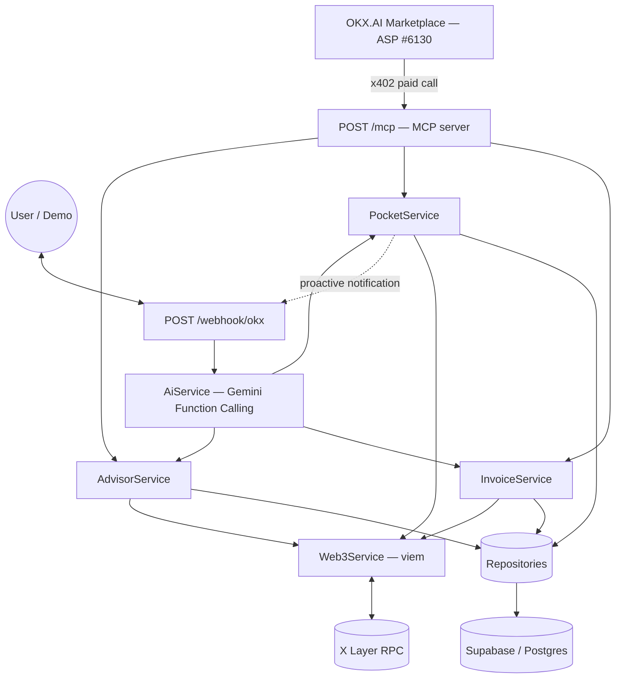

# SoloFi CFO 🤖💰
> Autonomous Web3 Finance Agent for Freelancers & Solopreneurs


Built for the **OKX.AI Genesis Hackathon** (deadline: 17 July 2026).

🔴 **Live:** registered on OKX.AI as ASP **#6130** (SoloFi CFO) — listing under review.
MCP endpoint: `https://solofi-cfo4.up.railway.app/mcp` (paid via x402, 0.2 USDT/call).

---

## 🎯 Problem Statement

Web3-native income earners — freelance developers, remote workers paid in stablecoins, crypto solopreneurs — lack the basic financial tooling that fiat freelancers take for granted. They track invoices and payments manually across wallets and spreadsheets, split incoming funds into savings/operations by hand, and have no natural-language way to check their financial health.

## 💡 Solution

SoloFi CFO is a **backend-only AI agent** that plugs into the **OKX.AI** platform as a registered Agent Service Provider (ASP #6130). It has no UI of its own. Behind the scenes, it:

- generates Web3 invoices and watches the chain for payment,
- automatically routes incoming funds into user-defined "pockets" (wallets) by percentage,
- and answers financial questions in natural language.

It exposes **two entry points** over the same business logic:

- **`POST /mcp`** — a real [Model Context Protocol](https://github.com/modelcontextprotocol/typescript-sdk) server (JSON-RPC 2.0, `tools/list`/`tools/call`). This is what's registered with OKX.AI's marketplace as an **A2MCP** service — OKX's own agent calls these 4 tools directly with structured arguments, no LLM involved on our side. Billed per-call via **x402** (OKX's HTTP 402 payment protocol) at 0.2 USDT/call on X Layer testnet.
- **`POST /webhook/okx`** — a free-form chat interface (Gemini does NL → intent routing). Not required by OKX's registration, but a fully working standalone demo path — useful for judges to see the agent respond to plain English/Indonesian without needing an OKX.AI session.

There is no page to open, no dashboard to host.

## ✨ Features (MVP)

| Pilar | What it does |
|---|---|
| **1. Smart Invoicing & Auto-Tracking** | User asks in chat ("Create a 100 USDC invoice for Client B"), agent creates the invoice and a receiving wallet, then monitors X Layer until the matching transfer lands. |
| **2. Autonomous Budgeting — Pockets System** | User defines percentage-based allocation rules via chat (e.g. 70% Operational, 30% Savings). The moment a payment is detected, the agent splits and transfers funds on-chain automatically — no manual step. |
| **3. AI Financial Advisor Chat** | User asks natural-language questions ("How much is in my operations pocket?", "Cashflow summary this week?") and gets an instant, human-readable answer sourced from on-chain balances + Supabase. |

See [skill.md](skill.md) for the full intent list, function-calling schema, and messaging conventions, and [PRD.md](PRD.md) for user stories and requirements.

## 🏗️ Architecture

SoloFi CFO has **no frontend**. It is a single Node.js/TypeScript backend that receives webhooks from OKX.AI, resolves user intent through LLM function calling, executes the resulting business logic, and replies in the JSON format OKX.AI expects.



Layers follow Clean Architecture / separation of concerns:

- **Controllers** — parse and validate incoming OKX.AI webhook payloads.
- **Services** — `AiService` (Gemini prompts + tool use), `Web3Service` (viem: listen for USDC transfers, execute routing).
- **Repositories** — Supabase (Postgres) persistence for users, pocket rules, invoices, transaction logs.

Full component diagrams and sequence flows for each pilar live in [ARCHITECTURE.md](ARCHITECTURE.md).

## 🚀 Quick Start

```bash
git clone <repo-url>
cd solofi-apps
cp .env.example .env
npm install
npm run dev
```

There is no page to visit — once running, the service listens on `POST /mcp` (OKX ASP calls) and `POST /webhook/okx` (chat demo). Try it locally:

```bash
curl -X POST localhost:3000/webhook/okx \
  -H "Content-Type: application/json" \
  -d '{"userId": "0xTestWallet", "message": "Create a 100 USDC invoice for Client B"}'
```

Or against the live deployment — see the 🔴 Live line at the top of this file, and [docs/DEPLOYMENT.md](docs/DEPLOYMENT.md) for Railway deploy steps.

### Using RTK / Caveman helpers

- Run without installing globally: `npx caveman <args>` / `npx rtk caveman`
- For reproducible local dev (including `git clone` + `npm link` instructions), see [RTK_CAVEMAN_SETUP.md](RTK_CAVEMAN_SETUP.md).

## 🔧 Tech Stack

| Layer | Choice |
|---|---|
| Runtime / Language | Node.js + TypeScript |
| HTTP Framework | Express.js |
| AI / LLM | Google Gemini API (`@google/generative-ai`, `gemini-flash-latest`, Tool Use / Function Calling) — used only by the `/webhook/okx` demo path, not `/mcp` |
| Database | Supabase (PostgreSQL) |
| Web3 | `viem` (X Layer RPC, event watching, transaction execution) |
| Blockchain | X Layer (OKX's EVM-compatible L2), testnet chain 1952 |
| Agent protocol | Model Context Protocol (`@modelcontextprotocol/sdk`) — the real `/mcp` server registered with OKX |
| Payments | OKX x402 (`@okxweb3/x402-express`/`-core`/`-evm`) — per-call billing on `/mcp` |
| Platform | OKX.AI Agent Service Provider — **ASP #6130**, registered & submitted for review |

## 📡 API Reference

- **`POST /mcp`** — the registered OKX.AI A2MCP endpoint. Real MCP server ([src/mcp/server.ts](src/mcp/server.ts#L1)), stateless, JSON-RPC 2.0. Billed via x402 (0.2 USDT/call) when `OKX_API_KEY`/`OKX_SECRET_KEY`/`OKX_PASSPHRASE` are set; serves free otherwise. Exposes 4 tools, each taking an explicit `user_wallet` argument (best-guess auth contract — OKX never published how caller identity is carried on `tools/call`, see `docs/INTEGRATION_LOG.md` §1):
  ```bash
  curl -X POST https://solofi-cfo4.up.railway.app/mcp \
    -H "Content-Type: application/json" -H "Accept: application/json, text/event-stream" \
    -d '{"jsonrpc":"2.0","id":1,"method":"tools/list"}'
  ```
- **`POST /webhook/okx`** receives `{ userId, message }` free-form chat and returns `{ reply }`. Standalone demo path, not required by OKX. See [src/controllers/webhook.controller.ts](src/controllers/webhook.controller.ts#L1).
- **Outbound:** [`OkxNotifier`](src/services/OkxNotifier.ts#L1) calls back to OKX.AI to push proactive chat messages (e.g. payment-confirmed notifications) — see Pilar 4 in [skill.md](skill.md). Currently a no-op (gated behind an unconfirmed `OKX_AI_CALLBACK_URL` contract — not blocking).
- **Function/tool schema:** `createInvoice`, `setPocketRule`, `queryBalance`, `queryCashflow` — defined in [src/agent/functions/index.ts](src/agent/functions/index.ts#L1) (Gemini declarations) and [src/mcp/server.ts](src/mcp/server.ts#L1) (MCP tools), dispatched in [src/services/AiService.ts](src/services/AiService.ts#L1).

## 🌐 X Layer Integration

[`Web3Service`](src/services/Web3Service.ts#L1) watches X Layer for incoming USDC transfers to the agent's deposit wallet, marks the matching invoice `PAID`, and executes the pocket split as one or more on-chain ERC-20 transfers — all verifiable on the X Layer block explorer.

## 💬 Demo (example chat)

```
User:  Bagi 70% ke 0xABC... dan 30% ke 0xXYZ...
Agent: Got it — pocket rules saved: 70% → Operational (0xABC...), 30% → Savings (0xXYZ...).

User:  Buat invoice 100 USDC untuk Client B.
Agent: Invoice #INV-001 created. Ask Client B to send 100 USDC to 0xDEF...

[on-chain: 100 USDC lands in 0xDEF...]

Agent: 💥 Payment confirmed — 100 USDC from Client B received and split:
       70 USDC → Operational, 30 USDC → Savings.
```

See [docs/DEMO_SCRIPT.md](docs/DEMO_SCRIPT.md) for the full judged demo walkthrough.

## 🔒 Design Notes

- On-chain transfers require a verified invoice-payment event or explicit user authorization — never triggered blind.
- Private keys are never hardcoded or logged; read from environment variables / a secrets manager only.
- Every on-chain action is recorded in `transaction_logs` for a full audit trail.

## 🤝 Team

- **secondio10** — backend, OKX/x402/MCP integration, ASP registration
- **devDedeo** — backend collaborator
- **Ezra** — Railway deployment & ops

## 📄 License

MIT
