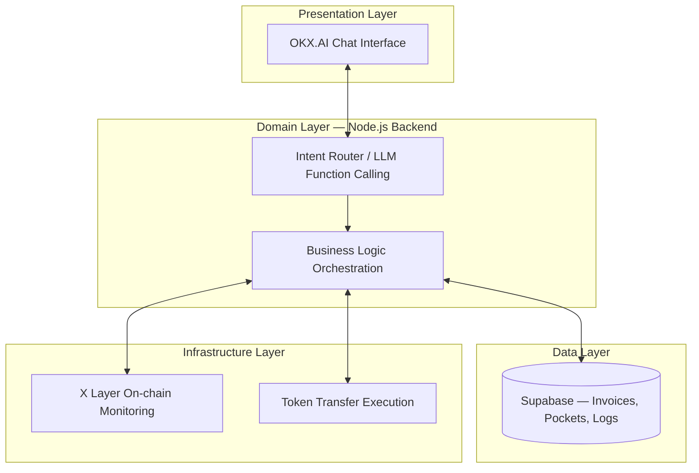

# SoloFi CFO 🤖💰

> Autonomous Web3 Finance Agent for Freelancers & Solopreneurs


Built for the **OKX.AI Genesis Hackathon** (deadline 17 July 2026).

---

## 🎯 Problem Statement

Web3 freelancers, remote workers, and solopreneurs get paid in crypto across multiple wallets and chains, but they're stuck doing the CFO job manually:

- Income is scattered across many wallets with no unified view
- No separation between personal and operational funds
- Manual allocation (savings, taxes, emergency fund) every time a payment lands is tedious and error-prone
- No readable cashflow reporting for non-technical users

## 💡 Solution

SoloFi CFO is an autonomous agent on the **OKX.AI** platform that acts as your automatic **Chief Financial Officer**. Connect a wallet on **X Layer** (OKX's EVM-compatible L2), define allocation rules in natural language chat, and let the agent handle invoicing, fund splitting, and reporting on-chain — no manual work required.

## ✨ Features (MVP)

### Pilar 1 — Smart Invoicing & Auto-Tracking
Ask in chat: *"Create an invoice for 100 USDC for Client B"*. The agent generates payment instructions, watches X Layer for the incoming transaction, and automatically records it as income once detected.

### Pilar 2 — Autonomous Budgeting ("Pockets System")
Define a rule once: *"Every time funds arrive, split: 50% Operations, 30% Personal, 20% Emergency Fund"*. As soon as a payment is detected, the agent executes on-chain transfers into each "pocket" wallet automatically, with every split logged.

### Pilar 3 — AI Financial Advisor Chat
Ask naturally: *"How much is left in my operations pocket?"* or *"Give me this week's cashflow summary"*. The agent reads on-chain + database data and answers in plain language.

## 🏗️ Architecture



See [`ARCHITECTURE.md`](./ARCHITECTURE.md) for full data flow diagrams and schema.

## 🚀 Quick Start

```bash
git clone <repo-url>
cd solofi-apps
npm install
cp .env.example .env      # fill in your keys
npm run dev
```

> Tech stack items marked TBD in `.env.example` / `package.json` will be finalized by the team before the build phase — see inline TODOs.

## 🔧 Tech Stack

| Layer | Choice | Status |
|---|---|---|
| Runtime | Node.js | ✅ |
| Framework | Express / Fastify / Hono | TBD |
| LLM | OpenAI Function Calling / OKX.AI built-in | TBD |
| Database | Supabase (PostgreSQL) | ✅ |
| Web3 | Viem / Ethers.js | TBD |
| Blockchain | X Layer (OKX EVM L2) | ✅ |
| Platform | OKX.AI Agent Platform | ✅ |

## 📡 API Reference

Agent capabilities are exposed as LLM function-calling definitions (see `src/agent/functions/`):

| Function | Params | Purpose |
|---|---|---|
| `createInvoice` | `client_name, amount, currency` | Generate a new invoice + payment instructions |
| `setPocketRule` | `rules: [{name, wallet_address, percentage}]` | Configure auto-split allocation rules |
| `queryBalance` | `pocket_name?` | Get current balance of one or all pockets |
| `queryCashflow` | `period: week\|month` | Natural-language cashflow summary |

See [`docs/api-spec.md`](./docs/api-spec.md) for full contracts.

## 🌐 X Layer Integration

`XLayerMonitor` watches incoming ERC-20 transfers (USDC/USDT) to a user's designated invoice wallet on X Layer. Once a matching payment is detected, `TokenTransfer` executes the pocket-split as a batch of on-chain transfers, and every transaction is logged in `transaction_logs`. See [`ARCHITECTURE.md`](./ARCHITECTURE.md#data-flow-diagrams) for the full sequence.

## 🎬 Demo

```
User: "Create an invoice for 100 USDC for Client Alpha"
Agent: "Invoice #INV-001 created. Ask Client Alpha to send 100 USDC to: 0xA1B2...C3D4"

[payment detected on-chain]

Agent: "Payment received! 100 USDC split into: 50 Operations, 30 Personal, 20 Emergency Fund ✅"

User: "What's my cashflow this week?"
Agent: "You received 250 USDC across 3 invoices. Operations pocket: 125 USDC, Personal: 75 USDC, Emergency: 50 USDC."
```

Full walkthrough: [`docs/DEMO_SCRIPT.md`](./docs/DEMO_SCRIPT.md)

## 🤝 Team

- [Your Name] — Lead / Full-stack
- [Teammate] — Web3 / Smart Contracts
- [Teammate] — Product / Design

## 📄 License

MIT
